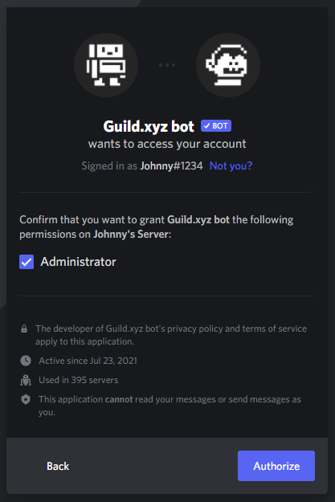

# Guild for Community Managers

## Choosing a realm

_Create a guild in a Discord server, or use it to gate a Telegram group._\
_Guild is going platform agnostic: 30+ platform integrations coming this year._



**Your Discord Server**

* **Create a new Discord server or use your already existing one:**\
  You will need Categories (Welcome/Community/Administrators) + Channels (gm/news/announcements) within these in your server. When you create your guild, you will be able to set which of your new roles get access to which of these categories or channels.\

* **Adding the Guild.xyz bot:**\
  Paste an invite link to your server here to invite the _Guild.xyz bot_ to your server. It's the best if you choose a non-expiring link, but if you don’t know how to set that, no worries the _Guild.xyz bot_ will know what’s up.

 (1) (1).png>)

On the Discord page that popped up after clicking on the _'Add Guild.xyz bot'_ button, choose the server you want the bot to be invited to. (it's possible that here you have to complete an 'I am not a robot' picture-selecting page as well)

.png>) 

* **Role of the Guild.xyz bot:**\
  ****Make sure the _Guild.xyz_ bot role is above every other role it has to manage (it'll generate one for your guild once it has been created). Alternatively, you can edit its role to be able to manage channels and roles.

 (1).png>)

After these, you can return to the guild page and continue creating your guild, the _Guild.xyz_ bot is now in your server.

* **Setting a starting channel:**\
  This is an already existing channel (welcome/gm/start-here) within your server where everyone who is joining your guild will enter first.\
  Don't worry! After setting up your guild, you can always change the starting channel by choosing another one and inviting the _Guild.xyz_ bot there with the /join-button command. _(more info at the 'Onboarding your community' section below)_

 (1).png>)

* **Managing roles:**\
  Guild creates your roles and makes sure about that only those who qualify can get access to it. What that role sees and does is fully up to you and your Discord settings. After your users gain access to a role within your Discord, you have the ability to manage what that role can do and see in all of your servers.\
  A useful tip is that you can manage roles by category as well, not just by channel. This can speed up your admin tasks :) Here's a link to [Discord's Role Management 101](https://support.discord.com/hc/en-us/articles/214836687-Role-Management-101)



**Your Telegram**

* **Create a new Telegram group or use your existing one:**\
  The Guild bot will manage the access control of the group, like a bouncer at a club's entrance.\

* **Adding the Guild bot:**\
  On the [Create Guild](https://guild.xyz/create-guild) page choose Telegram as a Realm

Click on the _'Add Guild bot'_, and this will lead you to Telegram where you can choose which group you want to add it to. Click on the selected group and add the bot. You will get the following message + an instructional video:\
 (1).png>)

The video shows you how to convert your group into a Supergroup. These are only a few steps and necessary for the Guild bot to function well later:

1. Click on the _'Info'_ and then the _'Edit'_ button
2. Choose _'Chat history for new members'_
3. Change the setting from _'Hidden'_ to _'Visible'_
4. _'Done'_\
   __

When you are done you'll get the next message + a video:\
 (1) (1) (1).png>)

This message contains a video, showing you the steps how to add the bot as an administrator:

1. Click on the _'Info'_ and then the _'Edit'_ button
2. Select _'Administrators'_
3. _'Add admin'_ and choose the _'Guild bot'_
4. _'Done'_\

After that you will get the following instructions:

 (1) (1).png>)

The group ID is what you have to copy and paste into the ‘Create guild’ page.

Good to know:

* Anyone who is in your group before adding guild bot can stay in the group even if they don't qualify for the guild's entry requirements.
* After creating the guild for your group, the invite link to this group will not let anyone in, only through your guild's page
* You can make the group private again after adding the bot, but don’t have to as the bot will not let in anyone without owning the required blockchain assets



## **Making your first guild**

**Step 1:** On the [guild.xyz](https://guild.xyz) homepage go to the _'Create guild'_ button.

**Step 2: Customisation**\
Give a name to your first guild, choose an icon or upload a picture for it. This will be the name for your whole guild as well, no matter how many roles you have in it later on. It will also be the name of your first role within the guild. Here you can add a short description for your guild, to let your members know what they are getting themselves into :) You can edit these names, descriptions and images later.

**Step 3: Choosing a requirement logic**\
For now, you can only use one type of logic per role:

* AND: This logic allows you to stack requirements with ‘AND’ logic, so users have to own ALL the listed requirements to gain access to that role. You can stack as many as you want to make the access to that role even more exclusive.
* OR: This logic allows you to stack requirements with ‘OR’ logic, so users have to own ONE of the listed requirements to gain access to that role. You can also stack as many requirements as you wish to make the access to that role more inclusive or widespread.
* Later on a combination of these logics (eg.: token ‘AND’ NFT ‘OR’ other NFT) will be available.

**Step 4: Setting requirements**\
You can combine assets across multiple blockchains (Ethereum, Polygon, Avalanche, Arbitrum, Celo, Fantom, Harmony, xDai or BSC, more on the way...) _**and**_ of multiple types (ERC-20, ERC-721 with specific traits, ERC-1155, whitelists of addresses, POAPs, having completed a Snapshot strategy, Mirror edition NFTs, Juicebox project assets even staked ones, Unlock protocol tokens)

Guild is listening to events on the blockchain all the time and revokes roles from users who sell the token/NFT required for participation.

Choose asset types or from our native integrations.

 (1) (1).png>) 

**Step 5: Summon your guild**

Hit _'Summon',_ and here you will have to sign a message with your wallet. This, as everything above, is free.

**Congratulations!** You have created your first guild! On your guild page you can see your members listed, yourself marked with a little crown. You will find a little _'edit'_ button next to the name of your guild. Clicking that will give you the options to:

* edit your guild,
* customize its appearance,
* add more roles to it to create membership layers within your server.

## **Making more roles in your guild**

(Note: this setting is available only for Discord)\
This process is even simpler than creating your first one because you already have the _Guild.xyz bot_ in your server. Creating more roles in your guild will allow you to have membership levels, layers or even subDAOs within your community.

1. Go to your guild page, click the '_edit'_ button on the right-hand side of your screen and choose _add role_.
2. Here it is the same steps you did with your first guild except you don’t have to choose a realm and invite the bot again. You will go through customization, choosing a logic type and setting requirements.
3. Hit '_Summon'_, sign a message with your wallet and you are ready to go.
4. From this point on your guild page will list all the roles, you can view each of their requirements by clicking '_view details'_.
5. Even though now you have multiple layers within your community, members will still have a single point of entry by clicking the '_Join guild'_ button on your guild page. They will instantly gain access to all the roles they satisfy the requirements for and will be directed to your server.

## Syncing your channel categories on Discord

Having different roles, layers in your community is a perfect opportunity for guild admins/community managers to build up a refined server and manage which channels the different roles have access to. Just like channels have permissions, so do categories. To make your life easier, all you have to do is syncing your channel categories so then every channel within one category will have the same permission setup.

Here's a short guide on how you can do it (so you don't have to go channel by channel):

1. **Arrange your categories and channels**\
   Do it however you want regarding to your plans with the roles' permissions. Mind you, when you move channels between categories, you'll be asked if you want to sync the permissions and the answer is Yes. This means that Discord will automatically update the permissions on a channel to match those of the category upon a move.\
   .png>)\

2.  **Manage the permissions**\
    There are now two default states for a channel: **synced** and **not-synced**.\
    A synced channel will have permissions that completely match that of the category. If you want the change the category permissions: right-click the category and click on the 'edit category'.\
     (1) (1).png>)\
    \
    Click on the _'Permissions'_ tab to alter permissions and add roles.\
    .png>)

    \
    **Good to know:**\
    1\. If you change the permissions on a category, all channels that are synced will automatically update.\
    2\. If you do not sync permissions when moving a channel between categories, or if you change an individual permission on the channel level, it will then show that the channel is not synced with the category.

    .png>)\
    \
    3\. Synced and not-synced channels can coexist within a category. Changing a category’s permissions will change all synced channel’s permissions, but not the permissions of any not-synced channel!

If you want to dive into this setup in details, read more here: [Channel Categories 101](https://support.discord.com/hc/en-us/articles/115001580171-Channel-Categories-101)

## **Onboarding your community**

Getting your community in your roles has multiple options, you can use the one that suits your community the best! Mind you, these can also be used at the same time without any trouble.

* **Option 1: Join button (/join-button)**\
  Whenever you create a new role in your guild the _Guild.xyz bot_ automatically posts a _Join ‘guild name’_ button in the channel you chose for the first point of entry for users. This button leads to authentication on your guild page. You can delete this button if you’d rather use an other method or want the button elsewhere. To insert the button in a different channel you have to type: /_join-button_ into the that channel and the bot will insert the button there.
* **Option 2: Sharing a link**\
  Sharing the link to your guild page with your users on any social platforms, privately in messages or publicly in your bio. If you use Discord with your community it will look like this: a pinned link into a channel in your server that leads to your guild page. Here members have to click on the '_Join guild'_ button to access all levels (roles) they are eligible for, sign a message and done.
* **Option 3: /join command**\
  Users can type in the _/join_ command into ANY channel in your server where they will see a private post by our bot (not DM but its only that one user who sees this in response to their command) with a button to authenticate on the guild page and boom, done.

## Verifying wallets, linking multiple addresses

In order to get your desired role(s), you need to connect and verify your wallet, address(es). Here's how you can do it step by step:

**On your desktop:**\
****1. Click on 'Connect to a wallet' on [guild.xyz](https://guild.xyz) and choose between the MetaMask, WalletConnect and Coinbase Wallet options.\
2\. Follow the wallet's instructions and sign the message to verify your address.\
3\. In order to link more addresses, change to the address you want to verify in your wallet, then click on your account on [guild.xyz](https://guild.xyz) and press the 'Sign message to verify address' button.

**On your mobile:**\
****1/a. MetaMask app browser: go to guild.xyz, click on 'Connect to a wallet' and choose between 'MetaMask' and 'Coinbase Wallet'.\
1/b. Other browsers: go to guild.xyz, click on 'Connect to a wallet' and choose between the WalletConnect and Coinbase Wallet options. (Note: if you have MetaMask wallet, just click on WalletConnect, then choose MetaMask)\
2\. Follow the wallet's instructions and sign the message to verify your address.\
3\. In order to link more addresses, change to the address you want to verify in your wallet, then click on your account on [guild.xyz](https://guild.xyz) and press the 'Sign message to verify address' button.

## **Troubleshooting 101**

These are the problems communities ran into the most & here's a step by step guide to help:

1. **Some people don’t get the role while others do:**\
   Sometimes these addresses have multisign on them which might cause issues. To solve the problem:
   * Try to use a different device to enter. Using a PC solves this issue sometimes.
   * Make sure the _Guild.xyz bot_ is above the other roles, is an Administrator or has permission to manage channels and roles
   * Ask for the users address who has the issue and check if they actually hold the right assets that would qualify for entry
   * If none of these worked, ping us\

2. **Deleting a role:**\
   If you want to delete a role, delete it on the guild page, not in Discord, the _Guild.xyz bot_ will do that for you.\

3. **Deleting a guild:**\
   The person who created the guild can delete a guild on said guild's page.\
   Click on the '_edit guild'_ button, and you will find a '_delete guild'_ button at the bottom of that page. This will delete the role in the Discord server as well, so you don't have to delete that in your server.

## Official links

Follow us on [Twitter](https://twitter.com/guildxyz)

Join our [Discord](https://discord.com/invite/guildxyz) server

Check out the Guild [Roadmap](https://roadmap.guild.xyz/?\_\_force)

Click on our [GitHub](https://github.com/agoraxyz/guild.xyz) to see what's shipping behind the scenes
